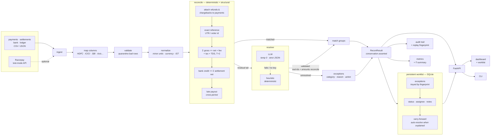
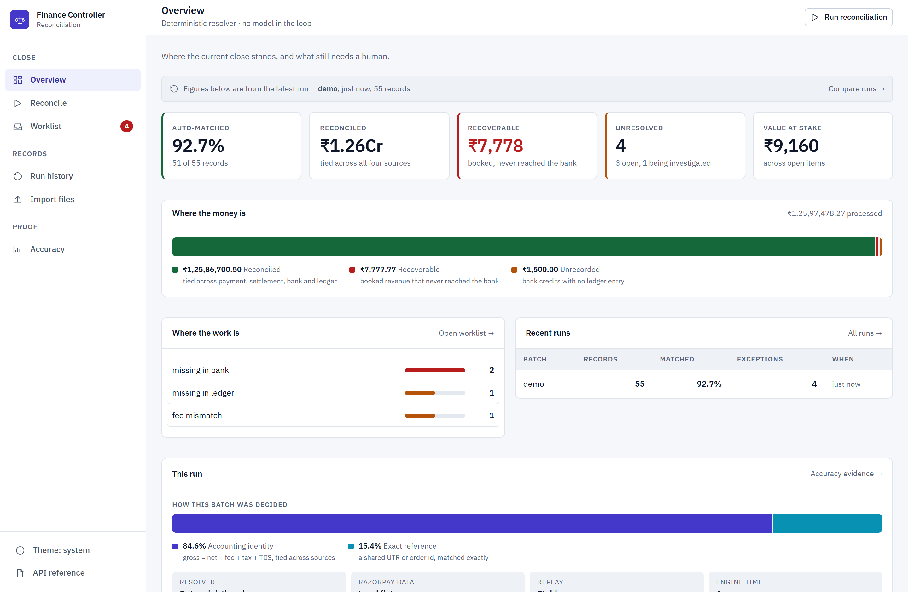
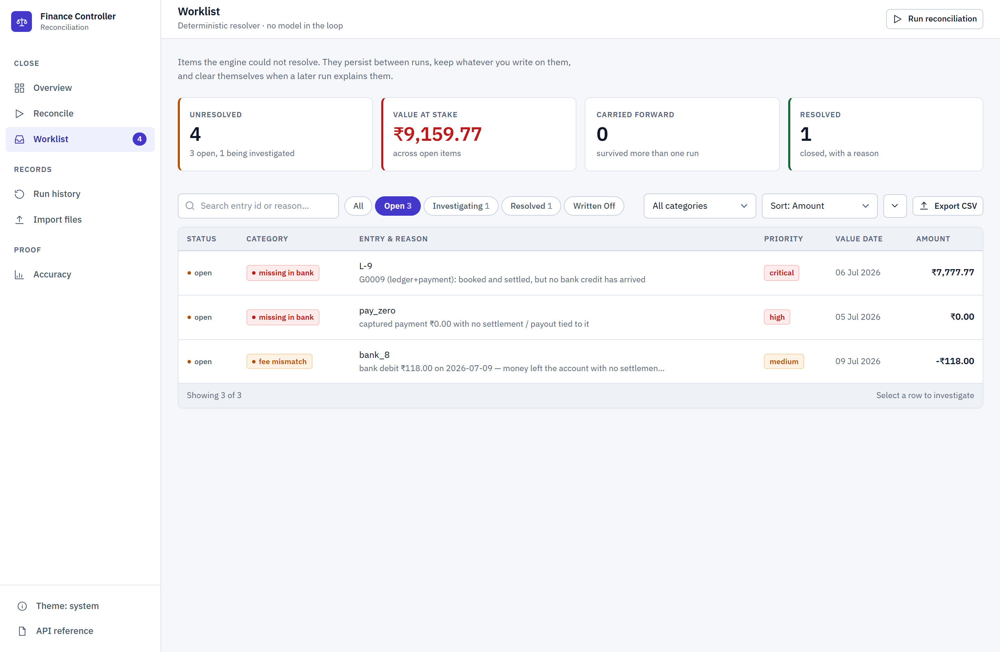
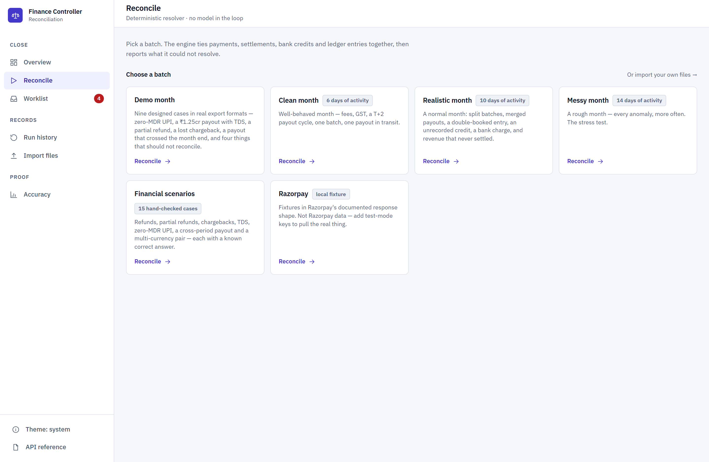
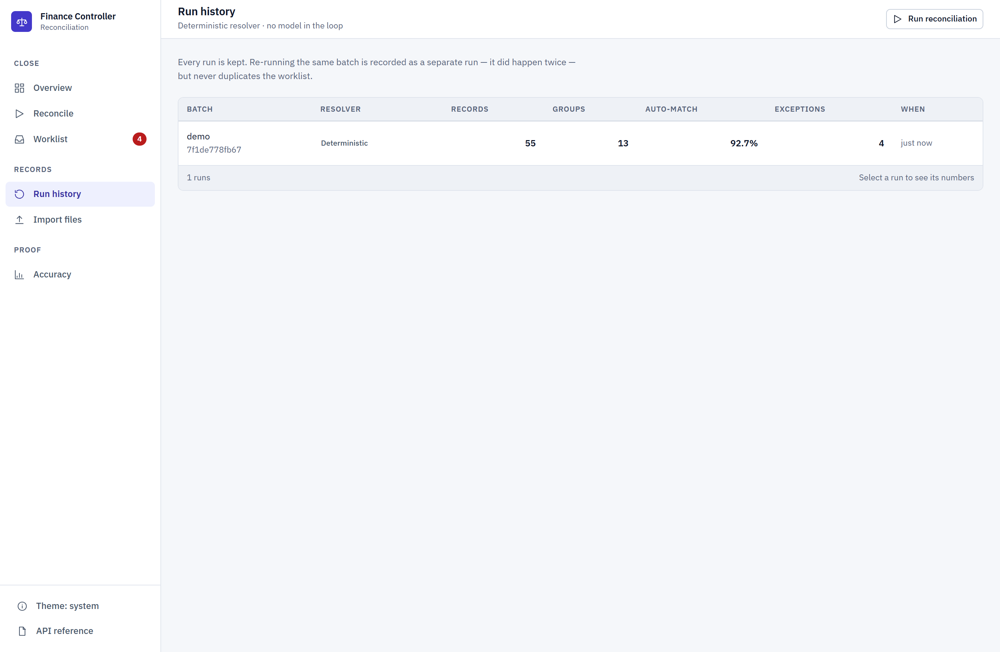

# AI Finance Controller

Four-way settlement reconciliation that closes a merchant's month-end loop,
scores itself on data it has never seen, and keeps the unresolved work between
runs.

Built for the [Razorpay AI Buildathon](https://razorpay.com/buildathon/) —
**Track 4: AI Finance Controller**.

[](https://github.com/pk7007/razorpay-buildathon/actions/workflows/ci.yml)

Python 3.11 · FastAPI · SQLite · no frontend build step · MIT

| held-out precision | held-out recall | ₹ in wrong groups | throughput | replay |
| --- | --- | --- | --- | --- |
| **1.0000** | **0.9928** | **₹0** | **~14k rec/s** | stable |

Every figure in this document was produced by a command in this repository, on
the committed datasets, with the LLM resolver switched off. Each section names
the command that reproduces it.

---

## Overview

Four exports describe the same money and none of them agree:

| Source | What it records |
| --- | --- |
| Payments (gateway) | gross captures, refunds |
| Settlements (payout) | net = gross − fee − tax − TDS − refunds − chargebacks |
| Bank statement | what actually credited the current account |
| Ledger / books | what accounting believes happened |

Hand this system those four files and it ties every rupee across all of them,
writes the arithmetic behind each match into an audit trail, and returns a
queue of what it could **not** resolve, with a reason and a suggested action on
every item.

## Why this exists

A month-end close is not a diff. The four sources disagree for legitimate
reasons — a payout batches fifteen payments into one credit, a refund lands
after the settlement it reduces, TDS is withheld at source, a bank charge
appears that no gateway record explains. A tool that compares two files and
reports the difference produces a list of differences, which is the input to the
work rather than the output.

Doing it manually takes days, and it is where revenue leaks quietly: payouts
that never arrived, bank credits nobody booked, batches nobody could attribute.
The loop is closed only when every rupee is matched, every unmatched item has a
documented reason, and re-running produces the same answer.

The problem is well-established rather than niche. Stripe acquired Recko, a
Bengaluru reconciliation startup, in October 2021 — its first India acquisition
— to own this workflow.

## What it does

Deterministic arithmetic does the matching. The settlement identity is
configured rather than assumed:

```
expected_net = gross − fee − tax − TDS − refunds − chargebacks + adjustments
```

Fees come from the settlement record when the source reports them, and from a
per-method rate card only when it does not — reported fees are marked `actual`,
inferred ones `estimated`, and the distinction travels with the number.

A language model is allowed near only the residual tail that these identities
cannot reach, and its output is validated before it counts. On the `realistic`
dataset the split is 95.1% structural, 2.4% deterministic, 2.4% resolver.

## Track 4 alignment

> *"Build an agent that closes one finance-ops loop across a 50+ record batch of
> synthetic data, reporting its match rate and the exceptions it could not
> resolve."*
> Bar: *"Throughput plus measured accuracy plus an honest exception list."*

| Requirement | Implementation | Verify with |
| --- | --- | --- |
| One finance-ops loop | Four-way settlement reconciliation, and only that | `docs/DEMO.md` |
| 50+ record synthetic batch | 55 / 125 / 352 / 466 bundled; 58,908 in the benchmark | `GET /api/datasets` |
| Synthetic data | Seeded generator with committed ground truth; CI fails if regeneration drifts | `scripts/make_datasets.py` |
| Match rate reported | Auto-match rate per run and aggregated | `GET /api/reconcile` |
| Measured accuracy | Precision/recall/F1 on five unseen seeds | `--evaluate` |
| Throughput | Timed at four batch sizes | `--benchmark` |
| Honest exception list | Non-zero, categorised, each with a reason and an action | `GET /api/exceptions` |

Match rate and accuracy are different numbers and are reported separately. Match
rate is the share of records the engine placed into a group. Accuracy is whether
those groups were correct, which requires ground truth — so the hand-authored
`demo` dataset reports a match rate and *no* precision, because no answer key
exists for it. The system does not invent an accuracy figure where none can be
computed.

## Architecture



### Why deterministic matching runs first

Reconciliation is mostly exact arithmetic, and exact arithmetic does not need a
model. Running the rules first means the model is never asked about a case that
has a provable answer — which bounds both cost and blast radius. By the time the
residual reaches the resolver it is a single-digit share of the batch, and
anything the resolver proposes is checked against the same arithmetic before it
is admitted.

The ordering also makes the system auditable. A rule-decided group can be
explained by printing its sum. A model-decided group cannot, so those are the
minority, they are labelled as such in the audit trail, and the UI shows the
split measured from the batch in front of you rather than from a diagram.

### Stateless engine, stateful workflow

- **Reconciliation is a pure function** of the batches it is given. Same input,
  same output, checked by a replay fingerprint on every run. It touches no
  database.
- **Reconciliation *work* is not.** An item unmatched in July matches in August;
  a team works a queue over days. The outcome is persisted, keyed by a stable
  fingerprint of the entry, which is what makes re-running idempotent.

SQLite, because it needs no service, ships inside the container, and a
merchant's reconciliation history is measured in megabytes.

Full write-up: [`docs/ARCHITECTURE.md`](docs/ARCHITECTURE.md).

## Reconciliation model

**Normalization.** Every row becomes a canonical `Entry`: integer minor units
(never floats), an explicit currency, an IST-normalized value date, and a
provenance tag. Per-currency minor units are respected — INR and USD are 100,
JPY is 1, KWD and BHD are 1000 — so formatting and rounding do not silently lose
a fils.

**Matching.** Union-find over accounting identities, in this order: refunds and
chargebacks attach to their payment; exact reference (UTR, order id) bucketed by
`(reference, currency)`; the settlement identity across sources within the T+2
window; bank credit against the sum of settlement nets; then late payouts across
a period boundary. Split batches (many payments → one payout) and merged payouts
(one credit → many settlements) are resolved by bounded, unique subset-sum with
constraint propagation.

**Fees, GST and TDS.** Rate cards are per method — percent, flat, or both — and
are configuration rather than code. GST applies to the fee, TDS under section
194-O to the gross. All money arithmetic is integer paise with half-away-from-zero
rounding; an earlier float-plus-banker's-rounding implementation was replaced
because it lost paise at scale.

**Refunds, partial refunds and chargebacks** are terms in the equation, not
unmatched noise. A ₹1,000 sale refunded ₹300 settles as ₹700 and still ties. Two
refunds against one payment both attach. A refund raised *after* its payout does
not retroactively shrink it — deductions are evaluated as of the payout date. An
open dispute is not treated as clawed back; a lost chargeback is.

**Currency is never crossed.** ₹1,000 cannot match $1,000. Cross-currency
*conversion* is not implemented — see Limitations.

**It refuses to guess.** When two assignments are equally valid the engine
declines, records why, and files an `ambiguous_split`. This costs recall and
protects precision, which is the intended trade: a wrong auto-match silently
closes the book on real money, while an exception merely asks a human.

## AI design

The model resolves only the residual tail — entries no accounting identity can
place, such as an off-gateway bank credit sharing no identifier with its ledger
entry.

```
deterministic + structural rules  →  residual  →  resolver  →  validation  →  admitted or exception
        (final, never revisited)      (~2%)      (LLM or heuristic)
```

What the boundary guarantees, enforced in `tests/test_ai_boundary.py` rather
than asserted here:

- The model is **never shown an entry a rule already placed**.
- Switching the model on leaves **every rule-decided group byte-for-byte
  identical**.
- A proposal naming an unknown id, claiming an entry twice, returning the wrong
  type, raising, or timing out **loses the proposal, not the run** — the pipeline
  falls back to the deterministic heuristic and writes the reason to the audit
  trail.
- Conservation is asserted: every entry ends in exactly one group or exactly one
  exception.

The bound is on **blast radius, not accuracy**, and the difference matters. A
model can pair two entries that are both genuinely in the residual and unrelated
to each other; that group is structurally valid and semantically wrong, and it
costs precision — forced on the `realistic` dataset it takes precision from
1.0000 to 0.9985 and recall to 0.9970. What cannot happen is a model altering a
rule-decided group, inventing an id, double-claiming, or losing a row. Claiming
it "can never cost precision" would be stronger than the code supports, so this
project does not claim it.

Bounds on the call itself: temperature 0, strict JSON, 20 s timeout, 2 retries,
a 150-entry cap above which the heuristic is used instead, and bank narration —
the one field an outsider can write into — flattened and truncated before it
reaches the prompt.

## Exception management

An unmatched item is a piece of work, not a log line:

```
open  →  investigating  →  resolved | written_off
```

- **Notes and assignee** per item, with full history.
- **Carry-forward** — a July sale with no payout stays open; when the August
  payout arrives it is auto-resolved, citing the run that explains it.
- **Idempotent** — re-running the same batch updates the queue rather than
  duplicating it, and human work on an item survives untouched.
- **Illegal transitions are refused** by the API with a 409.
- Every item carries a category, a rationale containing the arithmetic, a
  suggested action, and a confidence.

## Data sources

| Source | Provenance label | Notes |
| --- | --- | --- |
| Bundled synthetic datasets | `demo`, `clean`, `realistic`, `messy` | Seeded, with committed ground truth for the last three |
| Uploaded CSV / JSON | filename | Column mapping detected, bad rows quarantined |
| Razorpay test-mode API | `live_test` | Test-mode keys only; a non-`rzp_test_` key is refused |
| Razorpay fixtures | `fixture` | Local files in the documented API response shape |

The `fixture` / `live_test` distinction is enforced rather than cosmetic.
`/api/razorpay/status` **probes** the API instead of inferring from whether a key
is present, because a mistyped key is configured, well-formed, and still yields
fixtures. Fixture data is never labelled as Razorpay data.

## Evaluation

The matching rules were written against **one** seed. Scoring them on that seed
measures how well they were fitted, not whether they work — so the table below
is scored on **five seeds the rules have never seen**, using the offline
heuristic resolver.

| | runs | entries | precision | worst run | recall | F1 | exc-category | ₹ in wrong groups |
| --- | --- | --- | --- | --- | --- | --- | --- | --- |
| dev (rules tuned here) | 3 | 943 | 1.0000 | 1.0000 | 1.0000 | 1.0000 | 100.0% | ₹0 |
| **held-out (unseen seeds)** | **15** | **4,631** | **1.0000** | **1.0000** | **0.9928** | **0.9962** | **96.8%** | **₹0** |

**Generalisation gap: 0.38 F1 points.** All 15 runs replay-stable.

Not one rupee landed in an incorrect group across 4,631 held-out entries.

Recall is deliberately not 1.0. On one of fifteen runs, two different same-day
payment triples sum to the identical rupee. Amounts alone cannot decide it, so
the engine refuses, files the reason, and takes the recall hit — the worst
single run is 0.8927. That is the intended behaviour, written up in
[`docs/METRICS.md`](docs/METRICS.md).

### Per-dataset, measured

| dataset | records | matched | match rate | exceptions | precision | dropped |
| --- | --- | --- | --- | --- | --- | --- |
| `demo` | 55 | 51 | 92.7% | 4 | no answer key | 0 |
| `clean` | 125 | 125 | 100.0% | 0 | 1.0000 | 0 |
| `realistic` | 352 | 346 | 98.3% | 6 | 1.0000 | 0 |
| `messy` | 466 | 453 | 97.2% | 13 | 1.0000 | 0 |

Zero silent drops: every record ends in exactly one group or exactly one
exception, asserted on every run.

### Throughput

| records | time | records/sec |
| --- | --- | --- |
| 1,126 | 1.65 s | 684 |
| 5,840 | 0.73 s | 7,964 |
| 23,565 | 1.76 s | 13,358 |
| 58,908 | 4.18 s | 14,080 |

Single process, no database in the loop. The smallest batch is dominated by
fixed setup cost rather than per-record work, which is why records/sec *rises*
with batch size and then flattens — the per-record cost is roughly constant from
~24k records upward. Accuracy figures are deterministic and reproduce exactly;
throughput is a measurement and moves with the machine. Two consecutive runs
here landed within 4% of each other at 58,908 records (14,080 and 13,631).

### Test suite

| Suite | Count | Command |
| --- | --- | --- |
| Python | 907 passed, 3 skipped | `python -m pytest -q` |
| Frontend | 35 passed | `npm test --prefix web` |
| Lint | clean | `python -m ruff check .` |

Reproduce the accuracy and throughput tables:

```bash
python scripts/run_reconciliation.py --evaluate
python scripts/run_reconciliation.py --benchmark
```

or `GET /api/evaluation` and `GET /api/benchmark` on the running service.

## Failure cases and fixes

Bugs found during development that were worth keeping a note on, because each
one changed the design rather than just the code.

### Column mapping was applied on one path and not the others

**Symptom.** Reconciling a dataset directory whose CSVs used real-world bank
headers produced entries with `amount_paise = 0` and `value_date = 1970-01-01`.
The engine then "reconciled" them — a batch of zero-value rows on the epoch date
matches itself enthusiastically, so the run reported a high match rate over
meaningless data.

**Root cause.** Column detection and validation lived inside the upload
endpoint. The ingestion *preview* correctly detected mappings, and uploads were
fine. But `load_dataset()` and the directory loader fed raw parsed rows straight
to normalization, which found no column it recognised, defaulted every amount to
zero and every date to the epoch, and carried on. The failure was silent because
each stage individually behaved correctly on the input it was given.

**Fix.** Mapping, ambiguity refusal and row validation were moved into a single
`ingest.prepare()` that every path into the engine goes through — upload,
bundled dataset, directory on disk. One door, so a future path cannot bypass it.

**Regression tests.** `test_upload_never_matches_on_zeroed_amounts` and an
assertion in the messy end-to-end suite that no entry carries the epoch date. A
zero-amount row is also explicitly tested not to be absorbed into an unrelated
group, since ₹0 is the value most likely to "fit" anywhere.

**Status.** Fixed. The two assertions run on every push.

### A model returning the wrong type crashed the run

**Symptom.** `AttributeError: 'str' object has no attribute 'entry_ids'`.

**Root cause.** `resolve()` wrapped the model call in `try/except`, which catches
anything *raised* and nothing at all when the call returns successfully with
rubbish in it. A malformed return value reached the pipeline and died there — a
bad answer turned into an outage, which is the exact failure the AI boundary
exists to prevent.

**Fix.** The returned shape is validated and a `TypeError` raised, which puts it
back on the path that already handles a misbehaving resolver: fall back to the
heuristic and record why. Five malformed shapes are covered by parametrised
tests.

**Status.** Fixed. Held-out accuracy unchanged, so the guard is inert on the
shipped path.

### Tests passed only on a machine with no credentials

**Symptom.** Two guard tests failed once `.env` contained real Razorpay
credentials — meaning following this README's own setup instructions turned the
suite red.

**Root cause.** The tests called `fetch_live()` and expected a refusal, relying
on the ambient environment being empty rather than patching it. They were
testing the machine, not the guard.

**Fix.** Both now patch empty credentials in explicitly. Verified green both
with and without credentials present.

**Status.** Fixed.

## Razorpay integration

Test mode only. A key without the `rzp_test_` prefix is refused before any
network call, so the tool cannot be pointed at real customer data.

```bash
python scripts/verify_razorpay.py
```

**Verification status, run against a live test-mode account:**

| Check | Result |
| --- | --- |
| Credentials load | PASS |
| Key is test mode (`rzp_test_` prefix) | PASS |
| SDK installed | PASS |
| API connection | PASS — `provenance = live_test` |
| Secret printed anywhere | No — masked key hint only |
| Account contains data | No — 0 payments, 0 refunds, 0 settlements |

Connectivity and the ingestion path are verified. The test account is empty, so
a live run currently returns a batch labelled `razorpay-live_test` with zero
records rather than silently serving fixtures under a live label. Razorpay test
mode also does not issue settlements, so even a populated test account exercises
the ingestion path rather than closing the four-way loop — the bundled datasets
are what demonstrate the loop.

Production or live-mode credentials are **not required** for anything in this
repository, including the demo.

Setup walkthrough: [`docs/RAZORPAY.md`](docs/RAZORPAY.md).

## LLM integration

**Provider.** Anthropic Claude, via the `anthropic` SDK. Optional — with no key
the resolver runs its deterministic heuristic, and every number published here
was produced that way.

**Purpose.** The residual resolver only. It contributes roughly 2% of matches
and is not in the critical path.

```bash
python scripts/verify_llm.py
```

**Verification status:** the offline path — bounds, cost accounting, prompt
construction, injection flattening, refusal of hallucinated ids and
non-reconciling amounts — passes end to end. The live API call **fails
authentication** with the key currently configured (HTTP 401). The live LLM path
is therefore **not verified**.

The failure is worth reporting precisely, because it demonstrates the intended
degradation. With an invalid key present, a reconciliation run reports:

```
resolver_mode : heuristic
llm_calls     : 0
llm_cost_usd  : 0.0
audit         : llm-error-fallback@v1 — AuthenticationError: 401 …
precision     : 1.0    recall : 1.0
```

The run does not fail, does not claim a model was used, does not bill anything,
and writes the reason to the audit trail. A key being *present* is never
reported as the model being *used*.

Design notes: [`docs/LLM.md`](docs/LLM.md).

## Installation

Requires **Python 3.11+**. No database, no Node, and no external service is
needed to run or test the project.

```bash
git clone https://github.com/pk7007/razorpay-buildathon.git
cd razorpay-buildathon

python -m venv .venv
source .venv/bin/activate
pip install -r requirements.txt
pip install -e .
```

<details>
<summary>Windows PowerShell</summary>

```powershell
git clone https://github.com/pk7007/razorpay-buildathon.git
cd razorpay-buildathon

python -m venv .venv
.venv\Scripts\Activate.ps1
pip install -r requirements.txt
pip install -e .
```

Run each command on its own line. `&&` is not a valid statement separator in
Windows PowerShell 5.1 — use `;` if you need them on one line.
</details>

There is no database initialization step. SQLite creates the file on first
write, and `RECON_DB_PATH` controls where it lives.

## Environment variables

**Every variable is optional.** With no `.env` at all the product runs fully and
every published number reproduces. Copy the template only if you want the LLM
resolver or the Razorpay pull:

```bash
cp .env.example .env
```

| Variable | Purpose | Default |
| --- | --- | --- |
| `ANTHROPIC_API_KEY` | Switches the residual resolver from heuristic to LLM | *(unset → heuristic)* |
| `LLM_MODEL` | Model id | `claude-sonnet-5` |
| `LLM_TIMEOUT_SECONDS` / `LLM_MAX_RETRIES` | Bound the model call | `20` / `2` |
| `RAZORPAY_KEY_ID` / `RAZORPAY_KEY_SECRET` | **Test mode only.** A non-`rzp_test_` key is refused | *(unset)* |
| `RECON_API_TOKEN` | If set, every state-changing request must send it as `X-API-Token`; reads stay open | *(unset → open)* |
| `RECON_DB_PATH` | Where the exception queue lives | `data/reconciliation.db` |
| `AMOUNT_TOLERANCE_PAISE` | Cross-source rounding slack | `100` (₹1) |
| `SETTLEMENT_LAG_DAYS` | Payout cycle | `2` (T+2) |
| `RESOLVER_ACCEPT_THRESHOLD` | Minimum confidence to accept a resolver group | `0.72` |

Values above are variable **names** only. `.env` is gitignored and has never been
committed.

## Running the application

```bash
# dashboard + API  ->  http://localhost:8000
python -m uvicorn finance_controller.api:app --reload --port 8000

# CLI
python scripts/run_reconciliation.py --dataset messy --out out/
python scripts/run_reconciliation.py --input your/export/dir --out out/
```

The CLI writes `reconciliation.json`, `exceptions.csv`, `audit.jsonl` and
`metrics.json` into `--out`.

### Before a demo

```bash
python scripts/demo_reset.py
```

Moves the current database aside (renames, never deletes), reconciles the demo
month, and checks all 13 groups and 4 exceptions against an answer key — 23
assertions — before reporting the state safe to present. "It ran without an
error" is not a green light; producing the *same* groups and exceptions is. It
then works two exceptions so the queue shows a day in progress rather than a
wall of untouched rows.

## Demo

The demo month is 55 hand-authored records across six files: 13 designed cases
and 4 designed failures, small enough to read end to end, with the expected
outcome for every row known in advance.

Screenshots below are generated from that verified state by
`python scripts/demo_reset.py && python scripts/screenshots.py`, so the figures
on screen are the figures the demo produces.

| | |
| --- | --- |
| **Overview** — where the close stands, and what the money is doing | **Worklist** — exceptions that persist between runs |
| [](docs/screenshots/01-overview.png) | [](docs/screenshots/03-worklist.png) |
| **Reconcile** — run a batch and watch the audit trail fill | **Accuracy** — held-out scores, on seeds the matcher never saw |
| [](docs/screenshots/02-reconcile.png) | [](docs/screenshots/04-accuracy.png) |

There is no public deployed URL. See Deployment.

Walkthrough script: [`docs/DEMO.md`](docs/DEMO.md).

## Running tests

```bash
python -m pytest -q              # 907 python tests
npm test --prefix web            # 35 frontend tests, no node_modules
python -m pytest -q -m slow      # + throughput benchmark
python -m ruff check .           # lint

python scripts/verify_razorpay.py   # live Razorpay test-mode check
python scripts/verify_llm.py        # live LLM check
```

Frontend tests run on Node's built-in runner over the same ES modules the
browser loads — no dependencies, no lockfile, no `node_modules`.

Notable suites:

| File | What it covers |
| --- | --- |
| `test_financial_correctness.py` | An independent integer oracle recomputes the settlement identity across 504 combinations of fee, GST, TDS, refund and chargeback |
| `test_adversarial.py` | 17 attempts to make the matcher confidently wrong — identical amounts, near references, cross-currency, duplicate UTRs, a refund shaped like a payment |
| `test_ai_boundary.py` | The AI boundary as an enforced property, including the measured precision limit |
| `test_messy_end_to_end.py` | Real export formats through ingestion, mapping, validation, engine, SQLite and API |
| `test_database.py` | Integrity under 8 concurrent writers, and the store's locking behaviour |
| `test_scale.py` | The complexity curve, so a quadratic regression fails a test rather than a demo |
| `test_scenarios.py` | 15 hand-checked financial situations with known answers |

## Docker

There is no frontend build step by design; the container is the build.

```bash
docker build -t finance-controller .
docker run -p 8000:8000 finance-controller
```

The image has not been built on the development machine (Docker is not installed
there). CI builds it, starts the container, and reconciles a dataset over HTTP on
every push to `main` — the `docker build · run · reconcile` job is green, so the
image is verified by CI rather than by hand.

## Deployment

**Deployment configuration is included. Deployment has not been performed or
verified.** There is no live URL.

`render.yaml` is a Render blueprint targeting the Docker runtime with
`/api/health` as the health check. `RAZORPAY_KEY_ID`, `RAZORPAY_KEY_SECRET` and
`ANTHROPIC_API_KEY` are declared `sync: false` so they are entered in the Render
dashboard rather than committed.

On Render's free plan the container filesystem is ephemeral, so
`RECON_DB_PATH` does not survive a restart — the exception queue's notes,
assignees and resolution reasons are lost, while the engine is unaffected
because it is stateless and deterministic. A `disk:` block that fixes this is
present but commented out, because Render disks require a paid instance and a
blueprint that fails to deploy on the plan it declares is worse than one that
deploys with a stated limit.

Set `RECON_API_TOKEN` before exposing an instance publicly.

Full guide: [`docs/DEPLOYMENT.md`](docs/DEPLOYMENT.md).

## API

| Method | Endpoint | Purpose |
| --- | --- | --- |
| `GET` | `/api/health` | Liveness, and which resolver is active |
| `GET` | `/api/datasets` | Bundled benchmark datasets |
| `POST` | `/api/reconcile` | Reconcile a bundled dataset |
| `POST` | `/api/reconcile/upload` | Reconcile your own CSV/JSON exports |
| `POST` | `/api/reconcile/razorpay` | Razorpay test mode, else labelled fixtures |
| `GET` | `/api/razorpay/status` | Probed connectivity and provenance |
| `GET` | `/api/evaluation` | Dev vs held-out accuracy, served live |
| `GET` | `/api/benchmark` | Throughput at increasing batch sizes |
| `POST` | `/api/ingest/preview` | Proposed column mapping and row quality, before running |
| `GET` | `/api/exceptions` | The persistent worklist — filter, sort, search |
| `PATCH` | `/api/exceptions/{id}` | Change status or assignee (409 on an illegal move) |
| `POST` | `/api/exceptions/{id}/notes` | Annotate an item |
| `GET` | `/api/runs` | Reconciliation history |

```bash
curl -X POST http://localhost:8000/api/reconcile \
  -H 'content-type: application/json' -d '{"dataset":"realistic"}'
```

Full reference including the `ReconResult` schema: [`docs/API.md`](docs/API.md).
Interactive docs at `/docs` when the service is running.

## Security

- **Secrets are environment variables only.** `.env` is gitignored, has never
  been committed, and no credential appears in any tracked file or in git
  history — the only key-shaped strings in the repository are obvious
  placeholders (`rzp_test_xxxx…`) in `.env.example`, `docs/RAZORPAY.md` and test
  fixtures.
- **Credentials never reach the frontend.** `/api/razorpay/status` returns a
  masked key hint (`rzp_test_TXu…`) and a boolean; the secret is never
  serialised.
- **Secrets are never logged or printed.** `verify_razorpay.py` reports that the
  secret is set without echoing it.
- **Test-mode credentials only.** A key without the `rzp_test_` prefix is
  refused before any network call.
- **Optional write protection.** `RECON_API_TOKEN` gates every state-changing
  request behind `X-API-Token`, compared with `secrets.compare_digest`. Reads
  stay open so a deployed dashboard remains shareable.
- **Surface controls.** Same-origin only (no CORS), rate limiting, request size
  and row caps (1 MB JSON, 50,000 rows), and a `default-src 'self'` CSP —
  fonts are self-hosted so no external origin is needed.

If a credential is ever committed, rotating it in the Razorpay or Anthropic
dashboard is the fix. Deleting the file is not sufficient, because the value
remains in git history.

## Limitations

Stated plainly rather than buried.

- **The live LLM path is unverified.** The configured Anthropic key returns HTTP
  401. The offline branch is fully exercised against a stand-in for the SDK in
  `tests/test_llm_live.py`, and `scripts/verify_llm.py` will prove the live path
  in one command once a working key exists. Every number in this README was
  produced with the LLM switched off.
- **The Razorpay test account is empty.** Connectivity, authentication, test-mode
  enforcement and provenance labelling are verified against the live API; there
  are simply no payments, refunds or settlements in the account to ingest.
  Razorpay test mode does not issue settlements, so this path demonstrates
  ingestion rather than a closed loop.
- **No user model.** `RECON_API_TOKEN` protects writes, but there is no login, no
  per-user identity and no authorization — the audit trail records whatever
  `actor` the caller claims. This is the first thing to build before the system
  touches a real merchant's books.
- **The exception queue is ephemeral in a container** unless a disk is mounted.
  The engine is unaffected; the human's work is what is lost.
- **Large batches reconcile synchronously inside the request.** There is no job
  queue. 50,000 rows is the cap, measured at roughly 13 s here, and that
  measurement is what sets the cap.
- **FX-adjusted international settlements are not modelled.** Cross-currency
  matching is refused rather than approximated; conversion needs the settlement
  recon report as a join key.
- **The benchmark data is synthetic**, which is what the track asks for, but it
  is not a substitute for a real merchant's month.
- **Recall is 0.8927 on 1 of 15 held-out runs** — genuine ambiguity between two
  same-day payment triples summing to the identical rupee, documented rather
  than tuned away.
- **The Docker image is not built locally**, only in CI.
- **Not deployed.** Configuration is present and untested against a live Render
  instance.

## Project structure

```
razorpay-buildathon/
├── src/finance_controller/     the engine and the service
│   ├── api.py                  reconciliation routes, middleware, limits
│   ├── api_queue.py            workflow routes: queue, runs, ingest preview
│   ├── pipeline.py             wires the stages; asserts conservation
│   ├── reconcile.py            deterministic + structural matching
│   ├── resolver.py             LLM / heuristic residual resolver
│   ├── store.py                SQLite: runs, exception queue, history
│   ├── money.py                currency, minor units, provenance
│   ├── fees.py                 rate cards, TDS, the settlement equation
│   ├── mapping.py              universal bank-CSV column detection
│   ├── quality.py              ingestion validation, partial acceptance
│   ├── exceptions.py           categorises what could not be matched
│   ├── metrics.py              scoring, group status, ₹ summary
│   ├── evaluate.py             held-out split + throughput benchmark
│   ├── synth.py                benchmark generator + ground truth
│   ├── scenarios.py            15 hand-checked financial situations
│   ├── razorpay_source.py      test-mode pull + labelled fixtures
│   ├── ingest.py               the single door: map, validate, load
│   ├── normalize.py            raw rows -> canonical Entry
│   ├── models.py               the canonical schema
│   ├── audit.py                the decision log
│   └── config.py               env + tolerances
├── web/                        the console — 6 screens, no build step
│   ├── styles/                 design tokens, shell, components
│   ├── js/views/               dashboard, reconcile, worklist, runs, import, accuracy
│   ├── fonts/                  IBM Plex, self-hosted (the CSP allows no external origin)
│   └── tests/                  35 frontend tests — `npm test --prefix web`
├── data/datasets/              demo month + 3 benchmark datasets + answer keys
├── scripts/                    CLI, dataset generator, demo_reset, screenshots,
│                               verify_razorpay, verify_llm
├── tests/                      907 python tests
├── docs/                       architecture, metrics, api, dev, deploy, demo,
│                               pitch, llm, razorpay, data model
├── .github/workflows/ci.yml    lint · tests · reproducibility · docker
├── Dockerfile · render.yaml · Procfile
└── pyproject.toml · requirements.txt · .env.example
```

## Development

```bash
pip install -r requirements.txt && pip install -e .
python -m pytest -q
npm test --prefix web
python -m ruff check .
```

CI runs lint, the Python suite, dataset-regeneration determinism (the committed
datasets must regenerate byte-identically or the published numbers mean
nothing), the frontend suite, a held-out accuracy gate, a CLI smoke test, and a
Docker build that starts the container and reconciles over HTTP.

More detail: [`docs/DEVELOPMENT.md`](docs/DEVELOPMENT.md).

## Tech stack

| Layer | Choice | Why |
| --- | --- | --- |
| Language | Python 3.11 | |
| API | FastAPI + Uvicorn | Typed request/response, OpenAPI for free |
| Models | Pydantic v2 | One canonical schema across every stage |
| Storage | SQLite | No service to run, ships in the container |
| Frontend | Vanilla JS + CSS, no build step | No bundler or lockfile to break on another machine |
| AI | Anthropic Claude (optional) | Residual resolver only |
| Payments | `razorpay` SDK, test mode (optional) | Live ingest path |
| Tests | pytest, `node --test` | Including held-out accuracy gates |
| Lint | ruff | `E,F,I,UP,B,SIM` |
| Deploy | Docker · Render · Procfile | Stateless single process |

Razorpay, Anthropic, and all third-party libraries listed above are the property
of their respective owners and are used through their published interfaces. The
source code and documentation in this repository are original work.

## Team

| | |
| --- | --- |
| **Praveen Keshavan** | [@pk7007](https://github.com/pk7007) |

Solo submission.

## License

MIT — see [`LICENSE`](LICENSE).
