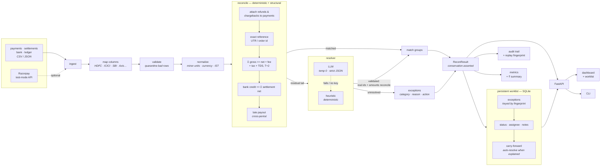

# AI Finance Controller

**Six-source settlement reconciliation that closes a merchant's month-end loop, proves its own accuracy on data it has never seen, remembers the work between runs, and tells you exactly how much money to go chase.**

Built for the **[Razorpay AI Buildathon](https://razorpay.com/buildathon/) — Track 4: AI Finance Controller**.

[](https://github.com/pk7007/razorpay-buildathon/actions/workflows/ci.yml)

Python 3.11 · FastAPI · SQLite · MIT · 898 + 35 tests

| held-out precision | held-out recall | ₹ in wrong groups | throughput | replay |
| --- | --- | --- | --- | --- |
| **1.0000** | **0.9928** | **₹0** | **~20k rec/s** | stable |

---

## What is actually different

Most reconciliation tooling **compares two records and reports the difference.**

This does four things instead, and each one is checkable in the running app:

| | |
| --- | --- |
| **Reconciles financial events, not rows** | A refund, a chargeback and a TDS deduction are terms in the settlement equation, not noise to filter out. A partially refunded sale settles for less and still ties. |
| **Explains every decision with the arithmetic** | Every match and every refusal writes an audit record containing the actual sum. Nothing is "matched (94%)" with no reason attached. |
| **Carries exceptions across periods** | The queue survives runs. An exception raised in July that a later batch explains closes itself; one that does not keeps its notes, its assignee and its age. |
| **Uses AI only on the residual uncertainty** | Rules decide first and what they decide is final. A model is shown only what is left — never an entry a rule already placed — so a bad answer from it can only ever affect the residual: it cannot change a rule-decided group, invent an id, claim an entry twice, or lose a row. |

The last one is the load-bearing claim, so it is enforced in code rather than
asserted: `tests/test_ai_boundary.py` checks that the model never sees a
rule-matched entry, that enabling it leaves every deterministic group byte for
byte identical, and that a model returning a hallucinated id, a double claim or
the wrong type entirely loses its proposal instead of the run.

The bound is on *blast radius*, not on accuracy, and the difference is worth
being exact about. A model that pairs two residual entries which happen to be
unrelated produces a group that is structurally valid and semantically wrong,
and that costs precision — forced on the `realistic` dataset, it takes
precision from 1.0000 to 0.9985 and recall to 0.9970. What the boundary
guarantees is that the damage stops there: the residual is the only thing a
model can touch, and the residual is a single-digit share of the batch. Saying
it "can never cost precision" would be a stronger claim than the code
supports, so the project does not make it.

The Overview screen shows the same split measured from the batch in front of
you:

```
How this batch was decided
  92.7%  accounting identity     gross = net + fee + tax + TDS, tied across sources
   4.6%  exact reference         a shared UTR or order id, matched exactly
   2.8%  scorer, on the residual a deterministic scorer — no model was involved
```

That number moves with the data. It is not a diagram.

## What it looks like

Regenerate these with `python scripts/demo_reset.py && python scripts/screenshots.py`,
so the figures on screen are always the figures the demo actually produces.

| | |
| --- | --- |
| **Overview** — where the close stands, and what the money is doing | **Worklist** — exceptions that persist between runs |
| [](docs/screenshots/01-overview.png) | [](docs/screenshots/03-worklist.png) |
| **Reconcile** — run a batch and watch the audit trail fill | **Accuracy** — held-out scores, on seeds the matcher never saw |
| [](docs/screenshots/02-reconcile.png) | [](docs/screenshots/04-accuracy.png) |


## Overview

Drop in four exports — payments, settlements, bank statement, ledger — and the
controller ties every rupee across all four, explains every match with the
actual arithmetic, and hands back an honest queue of what it could **not**
resolve and why.

## The problem

Every month-end close, a finance team reconciles four records that never line up:

| Source | What it says |
| --- | --- |
| **Payments** (gateway) | gross captures, refunds |
| **Settlements** (payout) | net = gross − fee − tax − TDS − refunds − chargebacks |
| **Bank statement** | what actually hit the current account |
| **Ledger / books** | what accounting *thinks* happened |

Doing this by hand takes days and is where revenue quietly leaks: payouts that
never landed, bank credits nobody booked, batches nobody could attribute. The
loop is only closed when every rupee is matched, every unmatched item has a
documented reason, and re-running gives the same answer.

This is not a niche problem. **Stripe acquired Recko — a Bengaluru reconciliation
startup — in October 2021, its first-ever India acquisition**, specifically to
own this workflow.

## The solution

A **deterministic-first, LLM-last, conservation-checked** reconciliation agent.

Reconciliation is mostly exact arithmetic, so exact arithmetic does the work.
The settlement identity is **configured, not assumed**:

```
expected_net = gross - fee - tax - TDS - refunds - chargebacks + adjustments
```

The fee comes from the settlement itself when the source reports it, and from a
per-method rate card only when it does not. An LLM is allowed near the small
ambiguous tail these identities cannot reach — and even then its answer is
checked before it counts.

> **An LLM should never decide where your money went. It should only make a
> suggestion that a rule then checks.**

## Key features

**Reconciliation**
- **Four-way matching** — union-find over accounting identities, handling split
  batches (many payments → one payout) and merged payouts (one credit → many
  settlements) via bounded, unique subset-sum with constraint propagation
- **No fee rate is assumed** — configurable rate cards per payment method
  (percent, flat, or both), plus TDS. Reported fees always beat the rate card and
  are marked `actual`; inferred ones are marked `estimated` and never presented
  as measured
- **Refunds, partial refunds, multiple refunds, chargebacks and disputes** as
  first-class financial events, not unmatched noise. A ₹1,000 sale refunded ₹300
  settles as ₹700; a refund raised *after* the payout does not retroactively
  shrink it; an open dispute is not treated as clawed back
- **Every amount carries a currency** — ₹1,000 can never match $1,000
- **Refuses to guess** — when two assignments are equally valid it declines,
  records why, and files an `ambiguous_split`

**Workflow (this is the part that makes it a product)**
- **Persistent exception queue** — an unmatched item becomes a piece of work with
  a status, priority, assignee, notes and full history
- **Carry-forward** — a July sale with no payout stays open; when the August
  payout arrives it is **auto-resolved**, citing the run that explains it
- **Idempotent** — re-running the same batch updates the queue rather than
  duplicating it, and human work on an item survives untouched
- **State machine** — `open → investigating → resolved / written_off`, with
  illegal transitions refused by the API

**Ingestion**
- **Universal column mapping** — verified against HDFC, ICICI, SBI, Axis and
  Kotak header layouts; split debit/credit columns folded into one signed amount
- **Preview before you commit** — see the proposed mapping and row-level quality
  before running anything
- **Partial acceptance** — bad rows are quarantined with the row number and
  reason; good rows still reconcile

**Evidence**
- **Replayable audit trail** — one record per decision, with the arithmetic in it
- **Measures itself on held-out data** — five seeds the rules have never seen
- **Works with the AI switched off** — no key ⇒ deterministic heuristic resolver

## Results

The matching rules were written against **one** seed. Scoring them on that seed
measures how well they were *fitted*, not whether they work — so everything
below is scored on **five seeds the rules have never seen**, using the offline
heuristic resolver (the worst case, not the best).

| | runs | entries | precision | worst run | recall | F1 | exc-category | ₹ in wrong groups |
| --- | --- | --- | --- | --- | --- | --- | --- | --- |
| dev (rules tuned here) | 3 | 943 | 1.0000 | 1.0000 | 1.0000 | 1.0000 | 100.0% | ₹0 |
| **held-out (unseen seeds)** | **15** | **4,631** | **1.0000** | **1.0000** | **0.9928** | **0.9962** | **96.8%** | **₹0** |

**Generalisation gap: 0.38 F1 points.** All runs replay-stable.

Precision is the metric held hardest and is reported per-run, not just as a mean:
a wrong auto-match silently closes the book on real money, while an exception
merely asks a human. **Not one rupee landed in an incorrect group across 4,631
held-out entries.**

Recall is deliberately *not* 1.0. On one of fifteen runs, two different same-day
payment triples sum to the identical rupee. Amounts alone cannot decide it, so
the engine refuses, files the reason, and takes the recall hit. That is the
intended behaviour — written up in full in [`docs/METRICS.md`](docs/METRICS.md).

### Throughput

| records | time | records/sec |
| --- | --- | --- |
| 1,126 | 0.05 s | 22,609 |
| 5,840 | 0.33 s | 17,971 |
| 23,565 | 1.74 s | 13,524 |
| 58,908 | 4.14 s | 14,244 |

Single process, no database in the loop. Across a 50× range throughput degrades
1.6× — effectively linear.

Accuracy numbers are deterministic and reproduce exactly. Throughput is a
*measurement*, so it moves with the machine and with whatever else it is doing:
repeated runs here land between roughly 14k and 23k records/sec on the smallest
batch. Treat the shape — linear, not quadratic — as the claim, and the absolute
figure as "this order of magnitude on a laptop".

**Reproduce every number above:**

```bash
python scripts/run_reconciliation.py --evaluate     # the accuracy table
python scripts/run_reconciliation.py --benchmark    # the throughput table
```

or `GET /api/evaluation` and `GET /api/benchmark` on the running service.

## Architecture



Full write-up: [`docs/ARCHITECTURE.md`](docs/ARCHITECTURE.md).

### Stateless engine, stateful workflow

The split is deliberate, and it is the core architectural idea:

- **Reconciliation is a pure function** of the batches it is handed. Same input,
  same output, verified by a replay fingerprint on every run. It touches no
  database.
- **Reconciliation *work* is not.** An item unmatched in July matches in August;
  a team works a queue over days. So the *outcome* is persisted — keyed by a
  stable fingerprint of the entry, which is what makes re-running idempotent.

SQLite, because it needs no service, ships inside the container, and a merchant's
reconciliation history is measured in megabytes.

There is no authentication, because there is nothing yet to protect: no accounts,
no tenancy, no third-party data. That changes the moment it touches a real
merchant's books, and [`docs/DEPLOYMENT.md`](docs/DEPLOYMENT.md) says so.

### Where the AI is, and where it is not

The LLM resolves only the **residual tail** — entries no accounting identity can
place, such as an off-gateway bank credit sharing no identifier with its ledger
entry. It contributes ~2% of matches, and it is not in the critical path:

- **It works with the AI switched off.** No key ⇒ deterministic heuristic. Every
  number in this README was produced that way.
- **Its output is checked, not trusted.** A proposal must name only real ids and
  must *arithmetically reconcile*. Confidence is an opinion; the arithmetic is a
  fact, and the fact wins.
- **It cannot invent or lose a row** — the pipeline asserts that every entry ends
  in exactly one group or exactly one exception.
- **It is bounded** — temperature 0, 20 s timeout, 2 retries, a 150-entry cap,
  and untrusted narration flattened before it reaches the prompt.

## Tech stack

| Layer | Choice | Why |
| --- | --- | --- |
| Language | Python 3.11 | |
| API | FastAPI + Uvicorn | typed request/response, free OpenAPI |
| Models | Pydantic v2 | one canonical schema across every stage |
| Frontend | Vanilla JS + CSS, **no build step** | no bundler, no lockfile, nothing to break on someone else's machine |
| AI | Anthropic Claude (**optional**) | residual resolver only |
| Payments | `razorpay` SDK, test mode (optional) | live ingest path |
| Tests | pytest (93) | incl. held-out accuracy gates |
| Lint | ruff | `E,F,I,UP,B,SIM` |
| Deploy | Docker · Render · Procfile | stateless single process |

## Project structure

```
razorpay-buildathon/
├── src/finance_controller/     the engine and the service
│   ├── api.py                  reconciliation routes, middleware, limits
│   ├── api_queue.py            workflow routes: queue, runs, ingest preview
│   ├── pipeline.py             wires the stages; asserts conservation
│   ├── reconcile.py            deterministic + structural matching
│   ├── resolver.py             LLM / heuristic residual resolver
│   ├── store.py                SQLite: runs, exception queue, history
│   ├── money.py                currency, minor units, provenance
│   ├── fees.py                 rate cards, TDS, the settlement equation
│   ├── mapping.py              universal bank-CSV column detection
│   ├── quality.py              ingestion validation, partial acceptance
│   ├── exceptions.py           categorises what could not be matched
│   ├── metrics.py              scoring, group status, ₹ summary
│   ├── evaluate.py             held-out split + throughput benchmark
│   ├── synth.py                benchmark generator + ground truth
│   ├── scenarios.py            15 hand-checked financial situations
│   ├── razorpay_source.py      test-mode pull + labelled fixtures
│   ├── ingest.py               files, bundled datasets
│   ├── normalize.py            raw rows -> canonical Entry
│   ├── models.py               the canonical schema
│   ├── audit.py                the decision log
│   └── config.py               env + tolerances
├── web/                        the console — 6 screens, no build step
│   ├── styles/                 design tokens, shell, components
│   ├── js/views/               dashboard, reconcile, worklist, runs, import, accuracy
│   ├── fonts/                  IBM Plex, self-hosted (the CSP allows no external origin)
│   └── tests/                  35 frontend tests — `node --test web/tests/`
├── data/datasets/              demo month + 3 benchmark datasets + answer keys
├── scripts/                    CLI, dataset generator, demo_reset, verify_razorpay, verify_llm
├── tests/                      898 python tests
│   ├── test_financial_correctness.py   the settlement identity vs an independent oracle
│   ├── test_adversarial.py             attempts to make the matcher confidently wrong
│   ├── test_ai_boundary.py             the model never sees what rules already decided
│   └── test_messy_end_to_end.py        real export formats through the whole product
├── docs/                       architecture, metrics, api, dev, deploy, demo, pitch
├── .github/workflows/ci.yml    lint · tests · reproducibility · docker
├── Dockerfile · render.yaml · Procfile
└── pyproject.toml · requirements.txt · .env.example
```

## Requirements

- **Python 3.11+**
- Docker *(optional — only for the container path)*
- No database, no Node, no external service required to run or test

## Installation

```bash
git clone https://github.com/pk7007/razorpay-buildathon.git
cd razorpay-buildathon

python -m venv .venv
source .venv/bin/activate       # macOS / Linux
pip install -r requirements.txt
pip install -e .
```

<details>
<summary>Windows PowerShell</summary>

```powershell
git clone https://github.com/pk7007/razorpay-buildathon.git
cd razorpay-buildathon

python -m venv .venv
.venv\Scripts\Activate.ps1
pip install -r requirements.txt
pip install -e .
```

Run each command on its own line. **`&&` is not a valid statement separator in
Windows PowerShell 5.1** — use `;` if you need them on one line.
</details>

## Environment variables

**Every variable is optional.** With no `.env` at all the product runs fully and
every published number reproduces. Copy the template only if you want the LLM
resolver or the Razorpay pull:

```bash
cp .env.example .env
```

| Variable | Purpose | Default |
| --- | --- | --- |
| `ANTHROPIC_API_KEY` | switches the residual resolver from heuristic to LLM. See [`docs/LLM.md`](docs/LLM.md) | *(unset → heuristic)* |
| `LLM_MODEL` | model id | `claude-sonnet-5` |
| `LLM_TIMEOUT_SECONDS` / `LLM_MAX_RETRIES` | bound the model call | `20` / `2` |
| `RAZORPAY_KEY_ID` / `RAZORPAY_KEY_SECRET` | **test mode only** — live pull. A non-`rzp_test_` key is refused. See [`docs/RAZORPAY.md`](docs/RAZORPAY.md) | *(unset)* |
| `AMOUNT_TOLERANCE_PAISE` | cross-source rounding slack | `100` (₹1) |
| `SETTLEMENT_LAG_DAYS` | payout cycle | `2` (T+2) |
| `RESOLVER_ACCEPT_THRESHOLD` | minimum confidence to accept a resolver group | `0.72` |

`.env` is gitignored and has never been committed. Use **test-mode** Razorpay
keys only.

## Running locally

```bash
# dashboard + API  ->  http://localhost:8000
python -m uvicorn finance_controller.api:app --reload --port 8000

# CLI
python scripts/run_reconciliation.py --dataset messy --out out/
python scripts/run_reconciliation.py --input your/export/dir --out out/
```

The CLI writes `reconciliation.json`, `exceptions.csv`, `audit.jsonl` and
`metrics.json` into `--out`.

## Before a demo

```bash
python scripts/demo_reset.py
```

Moves the current database aside (renames, never deletes), reconciles the demo
month, and checks every group and every exception against an answer key before
saying the state is safe to present. "It ran without an error" is not a green
light — producing the *same* nine groups and four exceptions is. It then works
two exceptions so the queue shows a real day rather than a wall of untouched
rows.

## Testing

```bash
python -m pytest -q              # 907 tests
node --test web/tests/           # 35 frontend tests, no node_modules
python -m pytest -q -m slow      # + throughput benchmark
python -m ruff check .           # lint
```

Notable among them: an **independent arithmetic oracle** that recomputes the
settlement identity in plain integers and checks 504 combinations of fee, GST,
TDS, refund and chargeback against the engine (`test_financial_correctness.py`);
**17 attempts to make the matcher confidently wrong** — identical amounts, near
references, cross-currency, duplicate UTRs, a refund shaped like another
payment (`test_adversarial.py`); the **AI boundary** enforced as a property,
not a claim (`test_ai_boundary.py`); **real export formats** driven through
ingestion, mapping, validation, the engine, SQLite and the API
(`test_messy_end_to_end.py`); **database integrity** under 24 concurrent
writers (`test_database.py`); and the **complexity curve**, so a quadratic
regression fails a test rather than a demo (`test_scale.py`).

Covering engine correctness, the conservation invariant, held-out generalisation
thresholds, generator determinism, every API error path, the LLM contract under a
mocked model (including prompt injection), security regressions, **15 hand-checked
financial scenarios** (refunds, TDS, chargebacks, carry-forward, multi-currency),
**the persistence workflow** (idempotency, state machine, auto-resolution), **real
bank header layouts**, and **adversarial input** — every case found by trying to
break the running system is kept as a test.

## Production build

There is no frontend build step by design. The container **is** the build:

```bash
docker build -t finance-controller .
docker run -p 8000:8000 finance-controller
```

## Deployment

Stateless single process — Docker, Render (`render.yaml` blueprint), or any
Procfile host. Full guide, scaling notes and the pre-production checklist:
[`docs/DEPLOYMENT.md`](docs/DEPLOYMENT.md).

## API

| Method | Endpoint | Purpose |
| --- | --- | --- |
| `GET` | `/api/health` | liveness + which resolver is active |
| `GET` | `/api/datasets` | bundled benchmark datasets |
| `POST` | `/api/reconcile` | reconcile a bundled dataset |
| `POST` | `/api/reconcile/upload` | reconcile your own CSV/JSON exports |
| `GET` | `/api/evaluation` | dev vs held-out accuracy, served live |
| `GET` | `/api/benchmark` | throughput at increasing batch sizes |
| `POST` | `/api/ingest/preview` | proposed column mapping + row quality, before running |
| `GET` | `/api/exceptions` | the persistent worklist — filter, sort, search |
| `PATCH` | `/api/exceptions/{id}` | change status / assignee (409 on an illegal move) |
| `POST` | `/api/exceptions/{id}/notes` | annotate an item |
| `GET` | `/api/runs` | reconciliation history |
| `POST` | `/api/reconcile/razorpay` | Razorpay test-mode, else labelled fixtures |

```bash
curl -X POST http://localhost:8000/api/reconcile \
  -H 'content-type: application/json' -d '{"dataset":"realistic"}'
```

Full reference incl. the `ReconResult` schema: [`docs/API.md`](docs/API.md).
Interactive docs at `/docs` when running.

## Hackathon

**Track 4 — AI Finance Controller.**

> *"Build an agent that closes **one finance-ops loop** across a **50+ record
> batch of synthetic data**, reporting its **match rate** and the **exceptions it
> could not resolve**."*
> Bar: *"**Throughput** plus **measured accuracy** plus an **honest exception list**."*

| Requirement | Where it is |
| --- | --- |
| one finance-ops loop | four-way settlement reconciliation, and only that |
| 50+ record synthetic batch | 55 / 125 / 352 / 466 bundled; **58,908** in the benchmark |
| match rate reported | auto-match rate, per run and aggregated |
| exceptions it could not resolve | categorised queue, each with a reason and an action |
| **throughput** | table above · `--benchmark` · `GET /api/benchmark` |
| **measured accuracy** | held-out table above · `--evaluate` · `GET /api/evaluation` |
| **honest exception list** | non-zero, reasoned, and the one failing run is written up |

Demo script: [`docs/DEMO.md`](docs/DEMO.md) · Pitch outline: [`docs/PITCH.md`](docs/PITCH.md)

### Submission status

- [x] Public repository
- [x] Architecture documentation
- [x] Working product with measurable results
- [x] Audit trail, replay-checked
- [x] Honest exception reporting
- [ ] 5-minute pitch video — script ready, not recorded
- [ ] Deployed URL — `render.yaml` ready, not deployed

### Known limitations

Stated plainly rather than buried:

- The **LLM path has not been run against the live API** (no key in the build
  environment). The whole branch — bounds, cost accounting, refusal of
  hallucinated ids and non-reconciling amounts, every failure mode — is exercised
  against a stand-in for the SDK in `tests/test_llm_live.py`, and
  `python scripts/verify_llm.py` proves it for real in one command once a key
  exists. **Every number published here was produced with the LLM switched off.**
  See [`docs/LLM.md`](docs/LLM.md).
- The **Razorpay pull has not been run against a live test-mode account** (no
  credentials in the build environment). The full path — guards, epoch parsing,
  paise handling, refund linkage, failure modes — is exercised against a stand-in
  for the SDK in `tests/test_razorpay_live.py`, and
  `python scripts/verify_razorpay.py` proves it for real in one command once keys
  exist. Until then the app reports its own data as `fixture`, never `live_test`.
- The **Dockerfile is not built locally** (Docker is not installed on the build
  machine). CI builds the image, starts the container and reconciles a dataset
  through it on every push to `main` — the `docker build · run · reconcile` job
  is green, so the image is verified, just not by hand here.
- **There is no user model.** Set `RECON_API_TOKEN` and every state-changing
  request — running a reconciliation, closing an exception, adding a note —
  must send it as `X-API-Token`; reads stay open so a deployed dashboard is
  still shareable. Unset, which is the default, the service is open, and that
  is what a local demo wants. What there is *not* is a login, per-user
  identity, or authorization: the audit trail records whatever `actor` the
  caller claims. That is the first thing to build before this touches a real
  merchant's data. The rest of the surface is small — same-origin only (no
  CORS), rate limited, input-capped, `default-src 'self'`.
- **The exception queue is ephemeral in a container.** The engine is stateless
  and deterministic, so a restart costs nothing there. The queue is SQLite at
  `RECON_DB_PATH`, which on a free Render instance or a volume-less `docker run`
  lives on an ephemeral filesystem — notes, assignees and resolution reasons are
  lost on restart. `render.yaml` carries a commented `disk:` block that fixes it
  on a paid instance, and [`docs/DEPLOYMENT.md`](docs/DEPLOYMENT.md) has the
  matrix.
- **A large batch reconciles synchronously inside the request.** There is no job
  queue: 50k rows is the cap, measured at ~13s here, and that is the number the
  cap is set by rather than what the engine could eventually chew through.
- **FX-adjusted international settlements are not modelled.** They need the
  settlement recon report as a join key.
- The benchmark is **synthetic**, which is what the track asks for, but it is not
  a substitute for a real merchant's month.
- Recall is **0.8927 on 1 of 15 held-out runs** — genuine ambiguity, documented.

## Team

| | |
| --- | --- |
| **Praveen Keshavan** | [@pk7007](https://github.com/pk7007) |

*Solo submission.*

## License

MIT — see [`LICENSE`](LICENSE).
