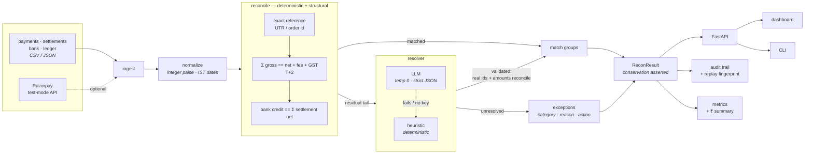

# AI Finance Controller

**Four-way settlement reconciliation that closes a merchant's month-end loop, proves its own accuracy on data it has never seen, and tells you exactly how much money to go chase.**

Built for the **[Razorpay AI Buildathon](https://razorpay.com/buildathon/) — Track 4: AI Finance Controller**.

Python 3.11 · FastAPI · MIT · 93 tests

| held-out precision | held-out recall | ₹ in wrong groups | throughput | replay |
| --- | --- | --- | --- | --- |
| **1.0000** | **0.9928** | **₹0** | **13,527 rec/s** | stable |

---

## Overview

Drop in four exports — payments, settlements, bank statement, ledger — and the
controller ties every rupee across all four, explains every match with the
actual arithmetic, and hands back an honest queue of what it could **not**
resolve and why.

## The problem

Every month-end close, a finance team reconciles four records that never line up:

| Source | What it says |
| --- | --- |
| **Payments** (gateway) | gross captures, refunds |
| **Settlements** (payout) | net paid out = gross − fee − 18% GST, on a T+2 cycle |
| **Bank statement** | what actually hit the current account |
| **Ledger / books** | what accounting *thinks* happened |

Doing this by hand takes days and is where revenue quietly leaks: payouts that
never landed, bank credits nobody booked, batches nobody could attribute. The
loop is only closed when every rupee is matched, every unmatched item has a
documented reason, and re-running gives the same answer.

This is not a niche problem. **Stripe acquired Recko — a Bengaluru reconciliation
startup — in October 2021, its first-ever India acquisition**, specifically to
own this workflow.

## The solution

A **deterministic-first, LLM-last, conservation-checked** reconciliation agent.

Reconciliation is mostly exact arithmetic, so exact arithmetic does the work:
`Σ payment gross == settlement net + fee + GST` on the T+2 date, and
`bank credit == Σ settlement net`. An LLM is only allowed near the small
ambiguous tail those identities cannot reach — and even then its answer is
checked before it counts.

> **An LLM should never decide where your money went. It should only make a
> suggestion that a rule then checks.**

## Key features

- **Four-way matching** — union-find over accounting identities, handling split
  batches (many payments → one payout) and merged payouts (one credit → many
  settlements) via bounded, unique subset-sum with constraint propagation
- **Refuses to guess** — when two candidate assignments are equally valid, it
  declines, records why, and files an `ambiguous_split` rather than picking one
- **Honest exception queue** — every unresolved row gets a category, a
  confidence, a plain-English reason and a suggested action
- **Replayable audit trail** — one record per decision, with the arithmetic in
  it; a fingerprint is re-checked on every run
- **Measures itself on held-out data** — five seeds the rules have never seen
- **Money summary in ₹** — reconciled / in-transit / **recoverable** / unrecorded
- **Works with the AI switched off** — no key ⇒ deterministic heuristic resolver
- **Batch upload or bundled benchmarks**, dashboard and CLI

## Results

The matching rules were written against **one** seed. Scoring them on that seed
measures how well they were *fitted*, not whether they work — so everything
below is scored on **five seeds the rules have never seen**, using the offline
heuristic resolver (the worst case, not the best).

| | runs | entries | precision | worst run | recall | F1 | exc-category | ₹ in wrong groups |
| --- | --- | --- | --- | --- | --- | --- | --- | --- |
| dev (rules tuned here) | 3 | 943 | 1.0000 | 1.0000 | 1.0000 | 1.0000 | 100.0% | ₹0 |
| **held-out (unseen seeds)** | **15** | **4,631** | **1.0000** | **1.0000** | **0.9928** | **0.9962** | **96.8%** | **₹0** |

**Generalisation gap: 0.38 F1 points.** All runs replay-stable.

Precision is the metric held hardest and is reported per-run, not just as a mean:
a wrong auto-match silently closes the book on real money, while an exception
merely asks a human. **Not one rupee landed in an incorrect group across 4,631
held-out entries.**

Recall is deliberately *not* 1.0. On one of fifteen runs, two different same-day
payment triples sum to the identical rupee. Amounts alone cannot decide it, so
the engine refuses, files the reason, and takes the recall hit. That is the
intended behaviour — written up in full in [`docs/METRICS.md`](docs/METRICS.md).

### Throughput

| records | time | records/sec |
| --- | --- | --- |
| 1,126 | 0.08 s | 13,527 |
| 5,840 | 0.52 s | 11,194 |
| 23,565 | 2.22 s | 10,622 |
| 58,908 | 6.56 s | 8,976 |

Single process, no database. Across a 50× range throughput degrades 1.5× —
effectively linear.

**Reproduce every number above:**

```bash
python scripts/run_reconciliation.py --evaluate     # the accuracy table
python scripts/run_reconciliation.py --benchmark    # the throughput table
```

or `GET /api/evaluation` and `GET /api/benchmark` on the running service.

## Architecture



Full write-up: [`docs/ARCHITECTURE.md`](docs/ARCHITECTURE.md).

### No database, no auth

Both absent **by decision, not omission**. A reconciliation is a pure function of
the four batches it is handed. Persisting results would add a breach surface and
a consistency problem while adding nothing to accuracy — so the run is in-memory
and the response is the only copy. That also makes deployment stateless and
horizontally trivial.

### Where the AI is, and where it is not

The LLM resolves only the **residual tail** — entries no accounting identity can
place, such as an off-gateway bank credit sharing no identifier with its ledger
entry. It contributes ~2% of matches, and it is not in the critical path:

- **It works with the AI switched off.** No key ⇒ deterministic heuristic. Every
  number in this README was produced that way.
- **Its output is checked, not trusted.** A proposal must name only real ids and
  must *arithmetically reconcile*. Confidence is an opinion; the arithmetic is a
  fact, and the fact wins.
- **It cannot invent or lose a row** — the pipeline asserts that every entry ends
  in exactly one group or exactly one exception.
- **It is bounded** — temperature 0, 20 s timeout, 2 retries, a 150-entry cap,
  and untrusted narration flattened before it reaches the prompt.

## Tech stack

| Layer | Choice | Why |
| --- | --- | --- |
| Language | Python 3.11 | |
| API | FastAPI + Uvicorn | typed request/response, free OpenAPI |
| Models | Pydantic v2 | one canonical schema across every stage |
| Frontend | Vanilla JS + CSS, **no build step** | no bundler, no lockfile, nothing to break on someone else's machine |
| AI | Anthropic Claude (**optional**) | residual resolver only |
| Payments | `razorpay` SDK, test mode (optional) | live ingest path |
| Tests | pytest (93) | incl. held-out accuracy gates |
| Lint | ruff | `E,F,I,UP,B,SIM` |
| Deploy | Docker · Render · Procfile | stateless single process |

## Project structure

```
razorpay-buildathon/
├── src/finance_controller/     the engine and the service
│   ├── api.py                  FastAPI routes, middleware, limits
│   ├── pipeline.py             wires the stages; asserts conservation
│   ├── reconcile.py            deterministic + structural matching
│   ├── resolver.py             LLM / heuristic residual resolver
│   ├── exceptions.py           categorises what could not be matched
│   ├── metrics.py              scoring, group status, ₹ summary
│   ├── evaluate.py             held-out split + throughput benchmark
│   ├── synth.py                benchmark generator + ground truth
│   ├── ingest.py               files, bundled datasets, Razorpay API
│   ├── normalize.py            raw rows -> canonical Entry
│   ├── models.py               the canonical schema
│   ├── audit.py                the decision log
│   └── config.py               env + tolerances
├── web/                        buildless dashboard (html/css/js)
├── data/datasets/              3 benchmark datasets + answer keys
├── scripts/                    CLI entry point, dataset generator
├── tests/                      93 tests
├── docs/                       architecture, metrics, api, dev, deploy, demo, pitch
├── .github/workflows/ci.yml    lint · tests · reproducibility · docker
├── Dockerfile · render.yaml · Procfile
└── pyproject.toml · requirements.txt · .env.example
```

## Requirements

- **Python 3.11+**
- Docker *(optional — only for the container path)*
- No database, no Node, no external service required to run or test

## Installation

```bash
git clone https://github.com/pk7007/razorpay-buildathon.git
cd razorpay-buildathon

python -m venv .venv
.venv\Scripts\activate          # Windows
source .venv/bin/activate       # macOS / Linux

pip install -r requirements.txt
pip install -e .
```

## Environment variables

**Every variable is optional.** With no `.env` at all the product runs fully and
every published number reproduces. Copy the template only if you want the LLM
resolver or the Razorpay pull:

```bash
cp .env.example .env
```

| Variable | Purpose | Default |
| --- | --- | --- |
| `ANTHROPIC_API_KEY` | switches the residual resolver from heuristic to LLM | *(unset → heuristic)* |
| `LLM_MODEL` | model id | `claude-sonnet-5` |
| `LLM_TIMEOUT_SECONDS` / `LLM_MAX_RETRIES` | bound the model call | `20` / `2` |
| `RAZORPAY_KEY_ID` / `RAZORPAY_KEY_SECRET` | **test mode only** — live payment/settlement pull | *(unset)* |
| `AMOUNT_TOLERANCE_PAISE` | cross-source rounding slack | `100` (₹1) |
| `SETTLEMENT_LAG_DAYS` | payout cycle | `2` (T+2) |
| `RESOLVER_ACCEPT_THRESHOLD` | minimum confidence to accept a resolver group | `0.72` |

`.env` is gitignored and has never been committed. Use **test-mode** Razorpay
keys only.

## Running locally

```bash
# dashboard + API  ->  http://localhost:8000
python -m uvicorn finance_controller.api:app --reload --port 8000

# CLI
python scripts/run_reconciliation.py --dataset messy --out out/
python scripts/run_reconciliation.py --input your/export/dir --out out/
```

The CLI writes `reconciliation.json`, `exceptions.csv`, `audit.jsonl` and
`metrics.json` into `--out`.

## Testing

```bash
python -m pytest -q              # 93 tests
python -m pytest -q -m slow      # + throughput benchmark
python -m ruff check .           # lint
```

Covering engine correctness, the conservation invariant, held-out
generalisation thresholds, generator determinism, every API error path, the LLM
contract under a mocked model (including prompt injection), and security
regressions (path traversal, error leakage, resource limits).

## Production build

There is no frontend build step by design. The container **is** the build:

```bash
docker build -t finance-controller .
docker run -p 8000:8000 finance-controller
```

## Deployment

Stateless single process — Docker, Render (`render.yaml` blueprint), or any
Procfile host. Full guide, scaling notes and the pre-production checklist:
[`docs/DEPLOYMENT.md`](docs/DEPLOYMENT.md).

## API

| Method | Endpoint | Purpose |
| --- | --- | --- |
| `GET` | `/api/health` | liveness + which resolver is active |
| `GET` | `/api/datasets` | bundled benchmark datasets |
| `POST` | `/api/reconcile` | reconcile a bundled dataset |
| `POST` | `/api/reconcile/upload` | reconcile your own CSV/JSON exports |
| `GET` | `/api/evaluation` | dev vs held-out accuracy, served live |
| `GET` | `/api/benchmark` | throughput at increasing batch sizes |

```bash
curl -X POST http://localhost:8000/api/reconcile \
  -H 'content-type: application/json' -d '{"dataset":"realistic"}'
```

Full reference incl. the `ReconResult` schema: [`docs/API.md`](docs/API.md).
Interactive docs at `/docs` when running.

## Hackathon

**Track 4 — AI Finance Controller.**

> *"Build an agent that closes **one finance-ops loop** across a **50+ record
> batch of synthetic data**, reporting its **match rate** and the **exceptions it
> could not resolve**."*
> Bar: *"**Throughput** plus **measured accuracy** plus an **honest exception list**."*

| Requirement | Where it is |
| --- | --- |
| one finance-ops loop | four-way settlement reconciliation, and only that |
| 50+ record synthetic batch | 125 / 352 / 466 bundled; **58,908** in the benchmark |
| match rate reported | auto-match rate, per run and aggregated |
| exceptions it could not resolve | categorised queue, each with a reason and an action |
| **throughput** | table above · `--benchmark` · `GET /api/benchmark` |
| **measured accuracy** | held-out table above · `--evaluate` · `GET /api/evaluation` |
| **honest exception list** | non-zero, reasoned, and the one failing run is written up |

Demo script: [`docs/DEMO.md`](docs/DEMO.md) · Pitch outline: [`docs/PITCH.md`](docs/PITCH.md)

### Submission status

- [x] Public repository
- [x] Architecture documentation
- [x] Working product with measurable results
- [x] Audit trail, replay-checked
- [x] Honest exception reporting
- [ ] 5-minute pitch video — script ready, not recorded
- [ ] Deployed URL — `render.yaml` ready, not deployed

### Known limitations

Stated plainly rather than buried:

- The **LLM path has not been run against the live API** (no key in the build
  environment). Its contract is covered by mocked tests; treat LLM numbers as
  unverified until a key is added.
- The **Dockerfile has never been built locally** (Docker not installed) — CI
  builds and runs it on every push.
- **FX-adjusted international settlements are not modelled.** They need the
  settlement recon report as a join key.
- The benchmark is **synthetic**, which is what the track asks for, but it is not
  a substitute for a real merchant's month.
- Recall is **0.8927 on 1 of 15 held-out runs** — genuine ambiguity, documented.

## Team

| | |
| --- | --- |
| **Praveen Keshavan** | [@pk7007](https://github.com/pk7007) |

*Solo submission.*

## License

MIT — see [`LICENSE`](LICENSE).
