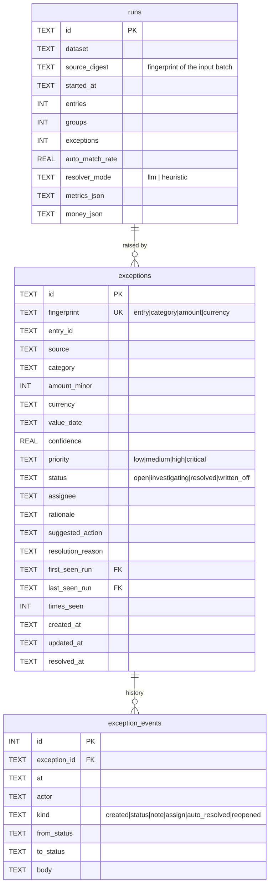

# Data model

Two halves, deliberately separated.

**The engine is stateless.** A reconciliation is a pure function of the batches
it is handed — same input, same output, verified by a replay fingerprint on
every run. It reads no database and writes none.

**The workflow is stateful.** An item unmatched in July matches in August; a
finance team works a queue over days. That outcome is persisted, so the work
survives.

---

## In-memory domain (the engine)

Everything downstream of ingestion speaks one vocabulary: `models.py`.

### `Entry`

One normalized row from any source. Money is an **integer in the minor units of
its currency** — paise for INR, cents for USD. Never a float.

| Field | Notes |
| --- | --- |
| `id` | unique *within a run*; repeats get a `#n` suffix so no row is lost |
| `source` | `payment` · `settlement` · `bank` · `ledger` · `refund` · `chargeback` |
| `amount_paise` | minor units of `currency` (the name is historical) |
| `currency` | every amount carries one; ₹1,000 can never match $1,000 |
| `value_date` | IST calendar date |
| `reference` | UTR / order id / external ref, cleaned; mined from bank narrations |
| `method` | `upi` / `card` / `netbanking` — selects the fee rule |
| `fee_paise`, `tax_paise`, `tds_paise` | settlement components. `tds_paise=None` means *not reported*, which differs from zero |
| `fee_reported` | `True` when the source supplied its own fee — drives actual-vs-estimated |
| `related_reference` | a refund or chargeback names the payment it reduces |
| `dispute_status` | `open` · `under_review` · `won` · `lost` · `accepted` |

**Refunds and chargebacks are first-class sources, not unmatched noise.** They
reduce what a merchant is owed, and the settlement identity subtracts them
explicitly.

### `MatchGroup`

A set of entries representing one real money movement, with the rule and the
arithmetic that joined them. `status` says whether the loop actually closed:

| Status | Meaning |
| --- | --- |
| `complete` | all legs tied |
| `awaiting_settlement` | recent sale, payout not raised yet |
| `awaiting_payout` | settled, bank credit due within the cycle |
| `payout_overdue` | should have landed → **recoverable** |
| `unbooked_payout` | money in the bank, never booked |
| `fully_refunded` | refunds/chargebacks cancelled it out; no payout is due |
| `ambiguous_split` | paid out, but not uniquely attributable to one batch |
| `partial` | legs missing with no clean explanation |

### `SettlementBreakdown` (`fees.py`)

The configurable identity that replaced `gross = net + 2% + 18%`:

```
expected_net = gross − fee − tax − TDS − refunds − chargebacks + adjustments
```

Every term carries **provenance**. A reported fee is `actual`; one inferred from
a rate card is `estimated`, and estimation is contagious — anything derived from
an estimate is itself estimated. `explain()` renders the arithmetic for a human.

---

## Persistent schema (the workflow)

SQLite. Three tables; each earns its place.



### `fingerprint` — why re-running is safe

```
fingerprint = entry_id | category | amount_minor | currency
```

Deliberately **excludes** the run id and timestamps: the same unresolved entry,
for the same reason, is the same piece of work no matter how many times the
batch is reconciled. Re-running therefore *updates* the row — bumping
`times_seen` so a stubborn item visibly ages — instead of creating a duplicate,
and any human work on it survives untouched.

Including the amount and currency means a **changed** amount correctly becomes a
new exception rather than silently mutating an old one.

A `UNIQUE` constraint enforces this at the database level, not just in code.

### Indexes

On `status`, `category`, `value_date`, `amount_minor`, `priority` and `assignee`
— the six things the worklist filters and sorts by. `runs` is indexed on
`started_at DESC` (history) and `source_digest` (has this batch been seen).

### State machine

```
open ─────────→ investigating ─────→ resolved
  │                   │                  │
  └───→ written_off ←─┘                  │
  ↑                                      │
  └──────────── reopened ────────────────┘
```

Enforced in `store.TRANSITIONS`; anything else raises `WorkflowError` → HTTP
409. The queue cannot reach a state nobody designed.

### Carry-forward

Two behaviours make the queue self-maintaining:

- **Auto-resolution.** If a run covers an entry but no longer raises an
  exception for it, the open item is resolved with
  `"matched by a later reconciliation run"` and an `auto_resolved` event citing
  the run. The July sale whose August payout arrived closes itself.
- **Reopening.** If a resolved item reappears, it returns to `open` with a
  `reopened` event, because someone closed it prematurely.

Both are logged. "Why is this closed?" always has an answer.

### Transactions and integrity

A run and its queue updates are written in **one transaction** — either the whole
run persists or none of it does. `PRAGMA foreign_keys=ON` is set, and
`exception_events` cascades on delete. Sort columns are whitelisted, and every
filter is a bound parameter, so no user input reaches SQL as text.

---

## What is deliberately absent

- **No users or tenancy table.** There are no accounts yet. `assignee` is a free
  text label, not a foreign key, because inventing an identity model before
  there is authentication would be architecture for its own sake.
- **No transactions table.** Entries are derived from the input batch on every
  run and are reproducible from it; storing them would create a second source of
  truth that could drift from the files.
- **No exchange-rate table.** Currency is carried and enforced end to end, but
  cross-currency *conversion* is not implemented — see
  [`METRICS.md`](METRICS.md) for what that would need.
